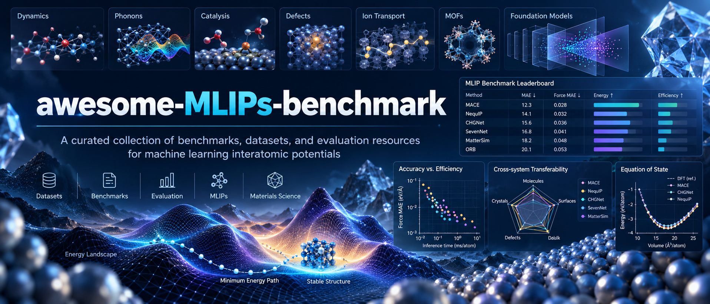

# Awesome MLIPs Benchmark

Index of benchmark studies, benchmark datasets, evaluation frameworks, and reliability studies for machine-learning interatomic potentials (MLIPs).

## Architecture gallery

[Explore the MLIP Architecture Gallery](mlip-arch-gallery/) — 53 Matbench Discovery model entries and 35 paper-grounded architecture diagrams, with source links, filtering, and a complete model index.

## Database

- **Records:** 133
- **Core:** 77
- **Supporting:** 56
- [Normalized index](data/mlips-benchmark-normalized.csv)
- [New additions](data/new-additions-2026-09-29.csv)
- [Schema](data/SCHEMA.md)
- [New additions checklist](data/NEW_ADDITIONS.md)
- [Curation report](data/CURATION_REPORT.md)

## Contents

- [Architecture gallery](#architecture-gallery)
- [Benchmark map](#benchmark-map)
- [Core benchmark resources](#core-benchmark-resources)
- [Supporting resources](#supporting-resources)

## Benchmark map

| Category | Records |
|---|---:|
| Benchmark suites and platforms | 9 |
| General and foundation MLIP evaluation | 29 |
| Dynamics and finite temperature | 4 |
| Phonons, vibrations and thermal | 8 |
| Surfaces, interfaces and catalysis | 12 |
| Batteries, diffusion and ion transport | 7 |
| Defects, disorder and dimensionality | 7 |
| Mechanical and elastic properties | 2 |
| Molecules, reactions and chemical kinetics | 10 |
| MOFs, zeolites and molecular crystals | 5 |
| Crystal search, stability and generation | 5 |
| Thermodynamics and phase diagrams | 1 |
| Experimental observables | 1 |
| Downstream electronic properties | 1 |
| Methodology, reliability and efficiency | 13 |
| Foundation datasets and model ecosystems | 15 |
| Broader atomistic ML benchmarks | 4 |

## Core resources (77)

### Benchmark suites and platforms

- [LAMBench: a benchmark for large atomistic models](https://www.nature.com/articles/s41524-025-01929-3) (2026) — Large-model evaluation across atomistic tasks.
- [MatCalc](https://matcalc.ai/) (2025) — Python framework released with MatPES; exposes reusable BenchmarkSuite APIs. Tasks: Property calculation and standardized elasticity/phonon benchmarks.
- [MLIP Arena: Advancing Fairness and Transparency in Machine Learning Interatomic Potentials via an Open, Accessible Benchmark Platform](http://arxiv.org/abs/2509.20630) (2025) — Open standardized MLIP comparison; leaderboard/platform.
- [MLIPAudit: A benchmarking tool for Machine Learned Interatomic Potentials](https://arxiv.org/abs/2511.20487) (2025) — Open Apache-2.0 benchmark library with reusable ASE-compatible pipeline and continuously updated leaderboard. Tasks: Modular downstream benchmark suite; CLI/GUI; public leaderboard; scaling. · [code](https://github.com/instadeepai/mlipaudit) · [data](https://huggingface.co/spaces/InstaDeepAI/mlipaudit-leaderboard)
- [MS25: Materials Science-Focused Benchmark Data Set for Machine Learning Interatomic Potentials](https://doi.org/10.1021/acs.jcim.5c01262) (2025) — E/F/S; observables; transferability; size extensivity.
- [JARVIS-Leaderboard: a large scale benchmark of materials design methods](https://www.nature.com/articles/s41524-024-01259-w) (2024) — energy/force/stress accuracy.
- [MatSciML: A Broad, Multi-Task Benchmark for Solid-State Materials Modeling](http://arxiv.org/abs/2309.05934) (2023) — energy/force/stress accuracy.
- [Benchmarking materials property prediction methods: the Matbench test set and Automatminer reference algorithm](https://www.nature.com/articles/s41524-020-00406-3) (2020) — energy/force/stress accuracy.

### General and foundation MLIP evaluation

- [Benchmarking chemically scalable machine-learning interatomic potentials for large-scale simulations of multicomponent alloys](https://link.aps.org/doi/10.1103/1qc9-ypyb) (2026) — energy/force/stress accuracy.
- [Benchmarking Compositional Generalisation for Machine Learning Interatomic Potentials](https://arxiv.org/abs/2605.08988v1) (2026) — energy/force/stress accuracy.
- [Benchmarking universal machine learning interatomic potentials on elemental systems](https://www.nature.com/articles/s41524-026-02251-2) (2026) — energy/force/stress accuracy.
- [Dyna-Mat: End-to-end benchmarking of foundation machine learning interatomic potentials in finite-temperature ensembles](http://arxiv.org/abs/2607.03433) (2026) — energy/force/stress accuracy; molecular dynamics / stability.
- [Origin of the machine learning forces field errors across metal elements](https://doi.org/10.1038/s41524-026-01977-3) (2026) — Metal-43 exposes strongly element-dependent intrinsic fitting difficulty. Tasks: Element-wise fitting difficulty; PES complexity.
- [Benchmarking CHGNet Universal Machine Learning Interatomic Potential against DFT and EXAFS: The Case of Layered WS2 and MoS2](https://doi.org/10.1021/acs.jctc.5c00955) (2025) — energy/force/stress accuracy.
- [CHIPS-FF: Evaluating Universal Machine Learning Force Fields for Material Properties](https://pubs.acs.org/doi/10.1021/acsmaterialslett.5c00093) (2025) — energy/force/stress accuracy.
- [Energy & Force Regression on DFT Trajectories is Not Enough for Universal Machine Learning Interatomic Potentials](http://arxiv.org/abs/2502.03660) (2025) — energy/force/stress accuracy.
- [Benchmarking of Universal Machine Learning Interatomic Potentials for Structural Relaxation](https://openreview.net/forum?id=fNyXCCZ0g6) (2024) — Structural relaxation; downstream workflow behavior.
- [Structure-based out-of-distribution (OOD) materials property prediction: a benchmark study](https://www.nature.com/articles/s41524-024-01316-4) (2024) — energy/force/stress accuracy; structure relaxation / PES search.
- [Systematic assessment of various universal machine-learning interatomic potentials](https://onlinelibrary.wiley.com/doi/abs/10.1002/mgea.58) (2024) — energy/force/stress accuracy.
- [Discrepancies and error evaluation metrics for machine learning interatomic potentials](https://www.nature.com/articles/s41524-023-01123-3) (2023) — application-specific evaluation.
- [M$^2$Hub: Unlocking the Potential of Machine Learning for Materials Discovery](http://arxiv.org/abs/2307.05378) (2023) — application-specific evaluation.

### Dynamics and finite temperature

- [Benchmarking Machine-Learning Interatomic Potentials for Dynamical Stability in Inorganic Semiconductor Nanocrystals: A CdSe Case Study](https://arxiv.org/abs/2609.15299) (2026) — Submitted 2026-09-14; finite, surface-dominated nanocrystal stress test. Tasks: Long-time MD stability; uncertainty-guided active learning; runtime.
- [MeltBench](https://jobs.sluschi-mapp.org/meltbench) (2026) — Open benchmark resource with MeltBench-10 and expansion toward larger suites. Tasks: Melting-point prediction with MLIPs.
- [Crash testing machine learning force fields for molecules, materials, and interfaces: model analysis in the TEA Challenge 2023](https://doi.org/10.1039/D4SC06530A) (2025) — TEA Challenge 2023 provides same-condition cross-architecture crash tests. Tasks: Common-data MLFF training; MD stability; incomplete data; multicomponent/periodic systems. · [data](https://doi.org/10.5281/zenodo.10414029)
- [Forces are not Enough: Benchmark and Critical Evaluation for Machine Learning Force Fields with Molecular Simulations](http://arxiv.org/abs/2210.07237) (2023) — MD observables and long-time stability.

### Phonons, vibrations and thermal

- [Vibrational power spectra as a tool to benchmark universal machine-learning interatomic potentials for molecular systems: the OMOL-1k-MD data set](https://doi.org/10.1038/s41524-026-02286-5) (2026) — 1000 systems and roughly 30 million AIMD structures. Tasks: Finite-temperature AIMD; vibrational power spectra; vibrational free energy. · [data](https://huggingface.co/datasets/JSteffen91/OMOL-1k-MD)
- [Benchmarking Universal Machine Learning Interatomic Potentials for Real-Time Analysis of Inelastic Neutron Scattering Data](http://arxiv.org/abs/2506.01860) (2025) — energy/force/stress accuracy.
- [PhononBench:A Large-Scale Phonon-Based Benchmark for Dynamical Stability in Crystal Generation](http://arxiv.org/abs/2512.21227) (2025) — energy/force/stress accuracy; molecular dynamics / stability; phonons / vibrational properties.
- [Thermal Conductivity Predictions with Foundation Atomistic Models](http://arxiv.org/abs/2408.00755) (2025) — Anharmonic heat transport; thermal expansion.
- [Universal machine learning interatomic potentials are ready for phonons](https://www.nature.com/articles/s41524-025-01650-1) (2025) — Harmonic phonon properties.
- [Benchmarking phonon anharmonicity in machine learning interatomic potentials](https://arxiv.org/abs/2402.18891) (2024) — Explicitly probes anharmonic rather than only harmonic phonons. Tasks: Anharmonic force constants; phonon interactions; thermal conductivity.

### Surfaces, interfaces and catalysis

- [Benchmarking machine-learned potentials for adsorption on Pt and IrO2 surfaces using OC20 and OMat24](https://doi.org/10.1007/s44371-026-00865-5) (2026) — Separates dataset/DFT-flavor effects for surface adsorption. Tasks: Adsorption energies; water-splitting intermediates.
- [Benchmarking universal machine learning interatomic potentials for supported nanoparticles: decoupling energy accuracy from structural exploration](https://www.nature.com/articles/s41524-026-02043-8) (2026) — energy/force/stress accuracy.
- [Design, assessment, and application of machine learning potential energy surfaces](https://doi.org/10.1088/2632-2153/ae47b9) (2026) — energy/force/stress accuracy; surface / adsorption / catalysis.
- [How accurate are foundational machine learning interatomic potentials for heterogeneous catalysis?](https://doi.org/10.1063/5.0317672) (2026) — Adsorption; reaction; vacancies; vibrations; structural relaxation.
- [CatBench framework for benchmarking machine learning interatomic potentials in adsorption energy predictions for heterogeneous catalysis](https://www.cell.com/cell-reports-physical-science/abstract/S2666-3864(25)00567-3) (2025) — Adsorption energies; relaxation anomaly handling.
- [Performance Assessment of Universal Machine Learning Interatomic Potentials: Challenges and Directions for Materials' Surfaces](https://doi.org/10.1021/acsami.4c03815) (2025) — energy/force/stress accuracy; surface / adsorption / catalysis.
- [Surface stability modeling with universal machine learning interatomic potentials: a comprehensive cleavage energy benchmarking study](https://doi.org/10.1088/3050-287X/ae1408) (2025) — energy/force/stress accuracy; surface / adsorption / catalysis.
- [Benchmarking of machine learning interatomic potentials for reactive hydrogen dynamics at metal surfaces](https://doi.org/10.1088/2632-2153/ad5f11) (2024) — Application benchmark couples accuracy to reactive trajectory observables. Tasks: Reactive gas-surface dynamics; sticking probabilities; CPU throughput.
- [Using machine learning to go beyond potential energy surface benchmarking for chemical reactivity](https://www.nature.com/articles/s43588-023-00549-5) (2023) — energy/force/stress accuracy; surface / adsorption / catalysis.

### Batteries, diffusion and ion transport

- [Benchmarking short-range machine learning potentials for atomistic simulations of metal/electrolyte interfaces](https://arxiv.org/abs/2602.22931v1) (2026) — energy/force/stress accuracy.
- [Benchmarking Universal Machine Learning Interatomic Potentials for Alkali-Ion Battery Kinetics](https://doi.org/10.1021/acsmaterialslett.6c00134) (2026) — Combines static barrier and dynamic transport evaluation. Tasks: Migration barriers; finite-temperature diffusion; structural correlations.
- [Li-P-S Electrolyte Materials as a Benchmark for Machine-Learned Interatomic Potentials](https://doi.org/10.1021/acs.jctc.5c02006) (2026) — energy/force/stress accuracy.
- [Performance-Based Selection of Machine Learning Interatomic Potentials for Studying Solid-State Electrolytes](https://doi.org/10.1021/acs.chemmater.5c02352) (2026) — Highlights energy-force consistency and subtle configurational generalization. Tasks: Structural; energetic; dynamic properties; disorder and transport.
- [Assessment and Application of Universal Machine Learning Interatomic Potentials in Solid-State Electrolyte Research](https://doi.org/10.1021/acsmaterialslett.5c00336) (2025) — energy/force/stress accuracy.
- [Benchmarking machine learning models for predicting lithium ion migration](https://www.nature.com/articles/s41524-025-01571-z) (2025) — energy/force/stress accuracy; migration / diffusion.

### Defects, disorder and dimensionality

- [Screening of Material Defects using Universal Machine-Learning Interatomic Potentials](https://doi.org/10.1002/smll.202503956) (2025) — Includes vacancy calculations for 86,259 materials. Tasks: Vacancy formation; defective-material screening; simulated etching.
- [Universal machine learning interatomic potentials poised to supplant DFT in modeling general defects in metals and random alloys](https://doi.org/10.1088/2632-2153/adea2d) (2025) — Broad defect-oriented validation in metals and alloys. Tasks: Point defects; grain boundaries; random alloys; H-alloy interactions; UQ; efficiency.
- [Universal Machine Learning Potential for Systems with Reduced Dimensionality](https://arxiv.org/abs/2508.15614) (2025) — Highlights dimensionality as a distribution-shift axis. Tasks: Cross-dimensional transferability; structure/energy/force evaluation.
- [Universal machine learning potentials under pressure](https://doi.org/10.1088/2515-7639/ae2ba8) (2025) — application-specific evaluation.
- [Efficiency, accuracy, and transferability of machine learning potentials: Application to dislocations and cracks in iron](https://doi.org/10.1016/j.actamat.2024.119788) (2024) — Three-stage validation from test error to defect transferability. Tasks: Dislocations; cracks; fracture; uncertainty; efficiency. · [code](https://github.com/leiapple/Potential_benchmark_iron)
- [Hydrogen under Pressure as a Benchmark for Machine-Learning Interatomic Potentials](https://arxiv.org/abs/2409.13390v1) (2024) — energy/force/stress accuracy.

### Mechanical and elastic properties

- [Evaluating mechanical property prediction across material classes using molecular dynamics simulations with universal machine-learned interatomic potentials](https://www.nature.com/articles/s42004-026-02057-9) (2026) — molecular dynamics / stability.
- [Benchmarking Universal Machine Learning Interatomic Potentials for Elastic Property Prediction](https://arxiv.org/abs/2510.22999) (2025) — Large-scale elastic-property benchmark; manuscript revised in 2026. Tasks: Elastic tensors/moduli; relaxation; targeted fine-tuning.

### Molecules, reactions and chemical kinetics

- [Accuracy and Efficiency Benchmarks of Pretrained Machine Learning Potentials for Molecular Simulations](https://doi.org/10.1021/acs.jctc.6c00130) (2026) — energy/force/stress accuracy; molecular dynamics / stability; efficiency / scaling.
- [Benchmarking Foundation Potentials against Quantum Chemistry Methods for Predicting Molecular Redox Potentials](https://doi.org/10.1021/prechem.5c00258) (2026) — energy/force/stress accuracy.
- [Benchmarking the UMA Foundation Interatomic Potential for Gas-Phase Chemical Kinetics](https://doi.org/10.1021/acs.jpca.6c01748) (2026) — energy/force/stress accuracy.
- [Benchmark of Approximate Quantum Chemical and Machine Learning Potentials for Biochemical Proton Transfer Reactions](https://doi.org/10.1021/acs.jctc.5c00690) (2025) — energy/force/stress accuracy.
- [Benchmarking Universal Machine Learning Force Fields with Hydrogen-Bonding Cooperativity](https://doi.org/10.4208/cicc.2025.90.02) (2025) — Probes cooperative many-body physics that standard molecular test errors can miss. Tasks: Many-body cooperativity / induction / dispersion.
- [Wiggle150: Benchmarking Density Functionals and Neural Network Potentials on Highly Strained Conformers](https://doi.org/10.1021/acs.jctc.5c00015) (2025) — energy/force/stress accuracy.
- [COMP6: A comprehensive benchmark suite for machine learning potentials](https://doi.org/10.1063/1.5023802) (2018) — Classic cross-domain molecular-potential benchmark suite. Tasks: Transferability across molecular datasets and conformers. · [code](https://github.com/isayev/COMP6)

### MOFs, zeolites and molecular crystals

- [Benchmark of machine learning force fields for silica zeolites](https://www.sciencedirect.com/science/article/pii/S1387181126001320) (2026) — energy/force/stress accuracy.
- [Benchmarking Universal Interatomic Potentials on Zeolite](https://doi.org/10.1021/acs.jpcc.5c06812) (2026) — energy/force/stress accuracy.
- [OMC-bench and AtomBit-OMC: task-aligned benchmarks and robust, interpretable machine-learned interatomic potentials for organic molecular crystals](https://www.nature.com/articles/s41524-026-02315-3) (2026) — OOD force/stress; lattice dynamics; cocrystal relaxation; polymorph ranking.
- [MOFSimBench: evaluating universal machine learning interatomic potentials in metal-organic framework molecular modeling](https://www.nature.com/articles/s41524-025-01872-3) (2025) — Molecular modeling; structural/dynamic properties.

### Crystal search, stability and generation

- [A framework to evaluate machine learning crystal stability predictions](https://www.nature.com/articles/s42256-025-01055-1) (2025) — Discovery/stability evaluation; relaxation; classification. · [code](https://github.com/janosh/matbench-discovery) · [data](https://matbench-discovery.materialsproject.org/)
- [LeMat-GenBench: A Unified Evaluation Framework for Crystal Generative Models](https://arxiv.org/abs/2512.04562) (2025) — application-specific evaluation.

### Thermodynamics and phase diagrams

- [Machine learning potentials for alloys: a detailed workflow to predict phase diagrams and benchmark accuracy](https://doi.org/10.1038/s41524-025-01814-z) (2025) — PhaseForge turns phase-diagram topology into an application-level MLIP benchmark. Tasks: Phase-diagram prediction; CALPHAD integration; phase classification.

### Experimental observables

- [UniFFBench: evaluating universal machine learning force fields against experimental measurements](https://www.nature.com/articles/s43588-026-01019-4) (2026) — MLFF validation against experimental measurements.

### Downstream electronic properties

- [Structural benchmarks overlook density-of-states errors in machine-learned interatomic potentials](https://doi.org/10.1063/5.0339982) (2026) — Published 2026-09-23; demonstrates that structural agreement does not guarantee DOS fidelity. Tasks: Structure relaxation; electronic DOS downstream validation. · [code](https://github.com/entropy4energy/2026-mlip-dos-benchmark) · [data](https://doi.org/10.1063/5.0339982)

### Methodology, reliability and efficiency

- [Are Machine Learning Interatomic Potentials Truly Practical? A Benchmark of 23 Mainstream Models](http://arxiv.org/abs/2607.07647) (2026) — energy/force/stress accuracy; efficiency / scaling.
- [FPBench: Application-Oriented Error Decomposition for Foundation Potentials](http://arxiv.org/abs/2609.05714) (2026) — Force decomposition; energy ranking; ion/vacancy migration.
- [Systematic softening in universal machine learning interatomic potentials](https://www.nature.com/articles/s41524-024-01500-6) (2025) — application-specific evaluation.
- [Performance and Cost Assessment of Machine Learning Interatomic Potentials](https://doi.org/10.1021/acs.jpca.9b08723) (2020) — energy/force/stress accuracy; efficiency / scaling.

### Foundation datasets and model ecosystems

- [Complexity of many-body interactions in transition metals via machine-learned force fields from the TM23 data set](https://doi.org/10.1038/s41524-024-01264-z) (2024) — TM23 is a widely used elemental-transition-metal stress test. Tasks: Element-wise force-field learnability; many-body complexity.

### Broader atomistic ML benchmarks

- [ECD: A Machine Learning Benchmark for Predicting Enhanced-Precision Electronic Charge Density in Crystalline Inorganic Materials](https://openreview.net/forum?id=SBCMNc3Mq3) (2024) — energy/force/stress accuracy.
- [Benchmarking Graphormer on Large-Scale Molecular Modeling Datasets](http://arxiv.org/abs/2203.04810) (2023) — energy/force/stress accuracy.

## Supporting resources

Supporting resources (56)

<strong>Benchmark suites and platforms</strong> (1)

- [The joint automated repository for various integrated simulations (JARVIS) for data-driven materials design](https://www.nature.com/articles/s41524-020-00440-1) (2020) — application-specific evaluation.

<strong>General and foundation MLIP evaluation</strong> (16)

- [A universal machine learning model for the electronic density of states](https://pubs.rsc.org/en/content/articlelanding/2026/dd/d5dd00557d) (2026) — application-specific evaluation.
- [Breaking the Training Barrier of Billion-Parameter Universal Machine Learning Interatomic Potentials](http://arxiv.org/abs/2604.15821) (2026) — application-specific evaluation.
- [Machine Learning Interatomic Potentials for Million-Atom Simulations of Multicomponent Alloys](https://arxiv.org/abs/2604.01642v2) (2026) — molecular dynamics / stability.
- [Machine-learned interatomic potentials for modeling multicomponent metallic systems: a comprehensive review](https://doi.org/10.1080/21663831.2026.2684721) (2026) — application-specific evaluation.
- [MatRIS: Toward Reliable and Efficient Pretrained Machine Learning Interatomic Potentials](http://arxiv.org/abs/2603.02002) (2026) — efficiency / scaling.
- [Universal Interatomic Potentials as Configuration-Space Generators for One-Shot and Iterative Fine-Tuning of Ab Initio-Accurate Material-Specific Models](http://arxiv.org/abs/2606.23214) (2026) — application-specific evaluation.
- [A foundation model for atomistic materials chemistry](https://doi.org/10.1063/5.0297006) (2025) — Broad application appendix is a useful de facto stress-test suite, though this is primarily a model paper. Tasks: Broad zero-shot application suite; fine-tuning. · [code](https://github.com/ACEsuit/mace-mp) · [data](https://github.com/ACEsuit/mace-mp)
- [Accelerating CALPHAD-based phase diagram predictions in complex alloys using universal machine learning potentials: Opportunities and challenges](https://www.sciencedirect.com/science/article/pii/S1359645425000400) (2025) — application-specific evaluation.
- [Machine learning interatomic potentials at the centennial crossroads of quantum mechanics](https://www.nature.com/articles/s43588-025-00930-6) (2025) — application-specific evaluation.
- [Machine-learning interatomic potentials from a users perspective: a comparison of accuracy, speed and data efficiency](https://doi.org/10.1088/1361-651X/adf56d) (2025) — efficiency / scaling.
- [PLaID++: A Preference Aligned Language Model for Targeted Inorganic Materials Design](http://arxiv.org/abs/2509.07150) (2025) — application-specific evaluation.
- [A Hitchhiker's Guide to Geometric GNNs for 3D Atomic Systems](http://arxiv.org/abs/2312.07511) (2024) — application-specific evaluation.
- [MatterSim: A Deep Learning Atomistic Model Across Elements, Temperatures and Pressures](https://arxiv.org/abs/2405.04967) (2024) — Broad temperature/pressure validation makes it useful as a reference stress-test paper. Tasks: Structures; dynamics; phonons; mechanics; thermodynamics; phase behavior. · [code](https://github.com/microsoft/mattersim)
- [Predicting stable crystalline compounds using chemical similarity](https://www.nature.com/articles/s41524-020-00481-6) (2021) — application-specific evaluation.
- [Machine Learning Interatomic Potentials as Emerging Tools for Materials Science](https://advanced.onlinelibrary.wiley.com/doi/10.1002/adma.201902765) (2019) — application-specific evaluation.
- [Machine learning of accurate energy-conserving molecular force fields](https://www.science.org/doi/10.1126/sciadv.1603015) (2017) — energy/force/stress accuracy.

<strong>Phonons, vibrations and thermal</strong> (2)

- [PFT: Phonon Fine-tuning for Machine Learned Interatomic Potentials](http://arxiv.org/abs/2601.07742) (2026) — phonons / vibrational properties.
- [Accelerating point defect photo-emission calculations with machine learning interatomic potentials](https://www.nature.com/articles/s41524-025-01820-1) (2025) — application-specific evaluation.

<strong>Surfaces, interfaces and catalysis</strong> (3)

- [Assessing universal MLIP robustness with per-atom uncertainty for simulations of solid-liquid interfaces](https://www.nature.com/articles/s41524-026-02051-8) (2026) — uncertainty / OOD.
- [How Ready Are Universal Machine-learned Interatomic Potentials for Carbon Capture Simulations?](https://chemrxiv.org/doi/full/10.26434/chemrxiv.15006048/v1) (2026) — application-specific evaluation.
- [Cross Learning between Electronic Structure Theories for Unifying Molecular, Surface, and Inorganic Crystal Foundation Force Fields](http://arxiv.org/abs/2510.25380) (2025) — energy/force/stress accuracy; structure relaxation / PES search; surface / adsorption / catalysis.

<strong>Batteries, diffusion and ion transport</strong> (1)

- [Probing Machine Learning Interatomic Potentials on Ion Transport Properties](https://advanced.onlinelibrary.wiley.com/doi/10.1002/aidi.70143) (2026) — migration / diffusion.

<strong>Defects, disorder and dimensionality</strong> (1)

- [Amorphous materials as a frontier challenge for universal interatomic potentials](http://arxiv.org/abs/2607.11384) (2026) — application-specific evaluation.

<strong>Molecules, reactions and chemical kinetics</strong> (3)

- [Chemical intuition on bond-dissociation energies as an emergent ability of universal machine-learning interatomic potentials](https://www.nature.com/articles/s41467-026-74919-8) (2026) — application-specific evaluation.
- [Reactive machine learning potential for accelerating transition state search in organic synthesis](https://www.nature.com/articles/s41467-026-72945-0) (2026) — application-specific evaluation.
- [Accurate global machine learning force fields for molecules with hundreds of atoms](https://www.science.org/doi/10.1126/sciadv.adf0873) (2023) — energy/force/stress accuracy.

<strong>MOFs, zeolites and molecular crystals</strong> (1)

- [Universal Machine Learning Interatomic Potentials Enable Accurate Metal-Organic Framework Molecular Modeling](https://openreview.net/forum?id=4Xh9oL5rH0) (2025) — application-specific evaluation.

<strong>Crystal search, stability and generation</strong> (3)

- [Framework-Constrained Materials Generation](https://openreview.net/forum?id=Yk4FcrVcU2) (2026) — application-specific evaluation.
- [Performance of universal machine learning potentials in global optimization of inorganic crystal structures](https://doi.org/10.1088/2632-2153/ae94e1) (2026) — energy/force/stress accuracy; structure relaxation / PES search.
- [Open Materials Generation with Stochastic Interpolants](https://openreview.net/forum?id=gHGrzxFujU) (2025) — application-specific evaluation.

<strong>Methodology, reliability and efficiency</strong> (9)

- [Net force analysis of the B3LYP-D3BJ/DZVP subset of the SPICE dataset: A diagnostic tool for machine learning force fields](https://doi.org/10.1016/j.jmgm.2026.109522) (2026) — Dataset-quality diagnostic showing why apparent RMSE gains can be confounded by molecular size. Tasks: Reference-force consistency; size-aware diagnostics.
- [Model-free estimation of completeness, uncertainties, and outliers in atomistic machine learning using information theory](https://doi.org/10.1038/s41467-025-59232-0) (2025) — QUESTS evaluates dataset coverage without requiring a trained potential. Tasks: Dataset completeness; OOD/outlier detection; uncertainty. · [code](https://github.com/dskoda/quests)
- [Multi-fidelity learning for interatomic potentials: low-level forces and high-level energies are all you need*](https://doi.org/10.1088/2632-2153/ae040b) (2025) — energy/force/stress accuracy.
- [Towards Fast, Specialized Machine Learning Force Fields: Distilling Foundation Models via Energy Hessians](https://arxiv.org/abs/2501.09009) (2025) — ICLR 2025; useful efficiency/physicality benchmark for model compression. Tasks: Foundation-model distillation; Hessian matching; MD conservation; speed. · [code](https://github.com/ASK-Berkeley/MLFF-distill)
- [Understanding and Mitigating Distribution Shifts For Machine Learning Force Fields](http://arxiv.org/abs/2503.08674) (2025) — energy/force/stress accuracy; uncertainty / OOD.
- [Learning from models: high-dimensional analyses of machine-learned interatomic potentials](https://doi.org/10.1038/s41524-024-01333-3) (2024) — Useful property-centric benchmark methodology beyond E/F errors. Tasks: High-dimensional property validation; Pareto analysis. · [code](https://github.com/mogroupumd/Learning_from_models)
- [Validation workflow for machine learning interatomic potentials for complex ceramics](https://doi.org/10.1016/j.commatsci.2024.112983) (2024) — Reusable three-stage validation workflow demonstrated on B4C. Tasks: Preliminary; static-property; dynamic-property validation.
- [How to validate machine-learned interatomic potentials](https://doi.org/10.1063/5.0139611) (2023) — Foundational best-practice paper for physically meaningful MLIP validation. Tasks: Numerical error metrics; physically guided validation; off-the-shelf model validation.
- [A framework for quantifying uncertainty in DFT energy corrections](https://www.nature.com/articles/s41598-021-94550-5) (2021) — energy/force/stress accuracy; uncertainty / OOD.

<strong>Foundation datasets and model ecosystems</strong> (14)

- [The Open Materials 2024 (OMat24) inorganic materials dataset and models](https://doi.org/10.1038/s43588-026-00996-w) (2026) — Over 110 million DFT calculations; central foundation-model dataset. Tasks: Non-equilibrium PES training; model evaluation; discovery/phonon/thermal downstream tests. · [code](https://github.com/FAIR-Chem/fairchem) · [data](https://huggingface.co/datasets/facebook/OMAT24)
- [A Foundational Potential Energy Surface Dataset for Materials](https://arxiv.org/abs/2503.04070) (2025) — PES dataset; equilibrium/off-equilibrium property benchmarks. · [code](https://matcalc.ai/) · [data](https://huggingface.co/datasets/materialyze/matpes)
- [MP-ALOE: an r2SCAN dataset for universal machine learning interatomic potentials](https://doi.org/10.1038/s41524-025-01834-9) (2025) — Nearly one million r2SCAN calculations over 89 elements. Tasks: Active-learning PES data; off-equilibrium force benchmark. · [code](https://github.com/matthewkuner/MP-ALOE) · [data](https://doi.org/10.6084/m9.figshare.29452190)
- [The Open Catalyst 2025 (OC25) Dataset and Models for Solid-Liquid Interfaces](https://arxiv.org/abs/2509.17862) (2025) — 7.8 million calculations across 1.5 million explicit-solvent environments. Tasks: Solid-liquid interface PES; solvation; off-equilibrium modeling. · [code](https://github.com/FAIR-Chem/fairchem)
- [The Open Molecules 2025 (OMol25) Dataset, Evaluations, and Models](https://arxiv.org/abs/2505.08762) (2025) — More than 100 million DFT calculations, 83 elements, systems up to 350 atoms. Tasks: Molecular PES training and broad OOD evaluation. · [code](https://github.com/FAIR-Chem/fairchem)
- [Advancing the ColabFit Exchange towards a Web-scale Data Source for Machine Learning Interatomic Potentials](https://openreview.net/forum?id=b8qZpGJIkw) (2024) — Supporting infrastructure rather than a direct leaderboard; useful for benchmark dataset discovery and provenance. Tasks: Dataset discovery; standardization; exchange for MLIP training and evaluation. · [data](https://colabfit.org/)
- [Expanding the SPICE Dataset with More Molecules and More Conformations](https://doi.org/10.1021/acs.jctc.4c00794) (2024) — SPICE 2 / Nutmeg expansion increases chemical and conformational diversity. Tasks: Expanded molecular PES coverage. · [code](https://github.com/openmm/spice-dataset) · [data](https://doi.org/10.5281/zenodo.10975225)
- [Improving machine-learning models in materials science through large datasets](https://doi.org/10.1016/j.mtphys.2024.101560) (2024) — Alexandria family provides multi-dimensional large-scale DFT data. Tasks: Large-scale DFT training dataset; broad materials evaluation. · [data](https://alexandria.icams.rub.de/)
- [CHGNet as a pretrained universal neural network potential for charge-informed atomistic modelling](https://doi.org/10.1038/s42256-023-00716-3) (2023) — MPtrj trajectory data became a major training/evaluation source for later foundation potentials. Tasks: Universal potential training and broad materials-property validation.
- [Open Catalyst 2022 (OC22) Dataset and Challenges for Oxide Electrocatalysts](https://doi.org/10.1021/acscatal.2c05426) (2023) — Large oxide electrocatalysis dataset and challenge. Tasks: Structure-to-energy/forces; relaxation for oxide electrocatalysis. · [code](https://github.com/FAIR-Chem/fairchem)
- [SPICE, A Dataset of Drug-like Molecules and Peptides for Training Machine Learning Potentials](https://doi.org/10.1038/s41597-022-01882-6) (2023) — More than 1.1 million conformations; broad molecular chemistry coverage. Tasks: Molecular energy/force training and benchmark data. · [code](https://github.com/openmm/spice-dataset)
- [Open Catalyst 2020 (OC20) Dataset and Community Challenges](https://doi.org/10.1021/acscatal.0c04525) (2021) — Foundational large-scale catalysis dataset and benchmark challenge. Tasks: S2EF; IS2RS; IS2RE catalyst tasks. · [code](https://github.com/FAIR-Chem/fairchem)
- [ANI-1x and ANI-1ccx quantum chemistry datasets](https://doi.org/10.1038/s41597-020-0473-z) (2020) — About 5M DFT structures plus a high-level coupled-cluster subset. Tasks: Large molecular PES training and transfer evaluation.
- [Revised MD17 (rMD17) benchmark dataset](https://doi.org/10.6084/m9.figshare.12672038) (2020) — Recomputed MD17 with tighter electronic-structure settings; ubiquitous molecular MLFF benchmark. Tasks: Molecular force-field interpolation and dynamics. · [data](https://doi.org/10.6084/m9.figshare.12672038)

<strong>Broader atomistic ML benchmarks</strong> (2)

- [Materials Graph Library (MatGL), an open-source graph deep learning library for materials science and chemistry](https://www.nature.com/articles/s41524-025-01742-y) (2025) — application-specific evaluation.
- [DScribe: Library of descriptors for machine learning in materials science](https://www.sciencedirect.com/science/article/pii/S0010465519303042) (2020) — application-specific evaluation.

## License

[CC BY 4.0](https://creativecommons.org/licenses/by/4.0/). Individual papers, datasets, and software retain their own licenses and copyrights.
