# MLIP Architecture Gallery

Matbench Discovery 模型架构图库 · **53 个活跃模型条目 / 35 张去重架构图**。本页在 GitHub 可直接完整预览；克隆仓库后也可打开 [`index.html`](index.html) 使用搜索、分类和图片放大功能。

[完整模型、论文与图片索引](SOURCES.md) · [Matbench Discovery 榜单](https://matbench-discovery.materialsproject.org/) · [图片资源目录](assets/)

> 排名按官方模型注册表提交 `e3d7966144e9653fb28c17c66a74dbc5686ff063` 和网站默认 CPS 公式重建，快照日期为 2026-10-03，并非实时榜单。图片由 OpenAI image_gen 根据论文内容生成，是架构示意而非论文原图；模块细节以原论文为准。

## 目录

- [Top 15](#top-15)
- [第 16–42 名](#第-1642-名)
- [其他活跃模型](#其他活跃模型)
- [无对应架构论文的模型](#无对应架构论文的模型)

---

## Top 15

前 15 名中具有对应架构图的模型；同一主干的规模变体合并展示。

本节 **11 张图**。点击图片可打开原始 PNG。

|  |  |
|---|---|
| <a href="assets/01_Prophet-OAME-MBD.png">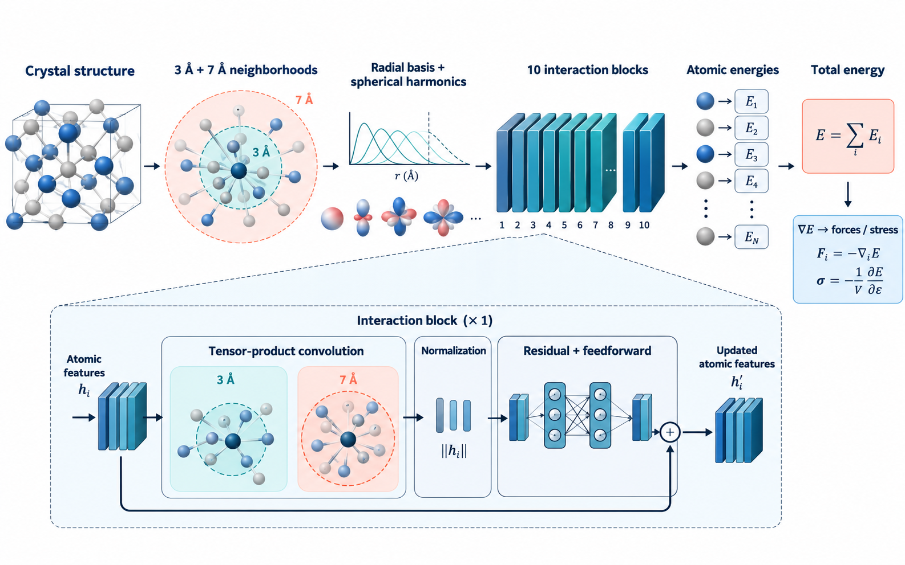</a> <strong>Prophet</strong> · 等变网络 <small>排名 #1 · Prophet-OAME-MBD</small> <small>论文：<a href="https://www.kairosmaterials.com/papers/Prophet.pdf">技术报告</a></small> | <a href="assets/02_TECE-OAM-RRA-1.0.png">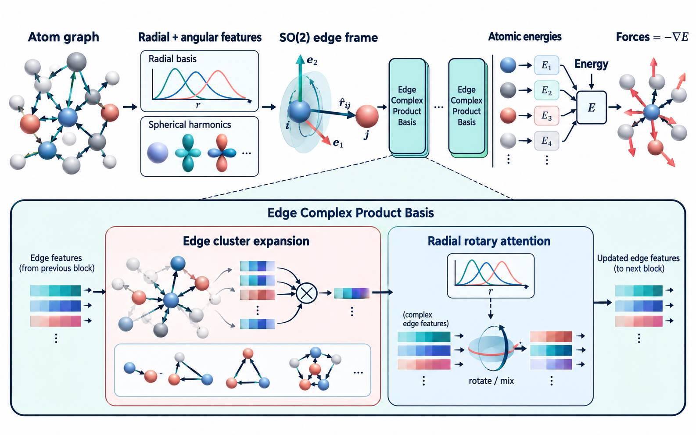</a> <strong>TECE</strong> · 等变网络 <small>排名 #2 · TECE-OAM-RRA-1.0</small> <small>论文：<a href="https://arxiv.org/abs/2607.10664">arXiv:2607.10664</a></small> |
| <a href="assets/03_EquiformerV3-DeNS-OAM.png">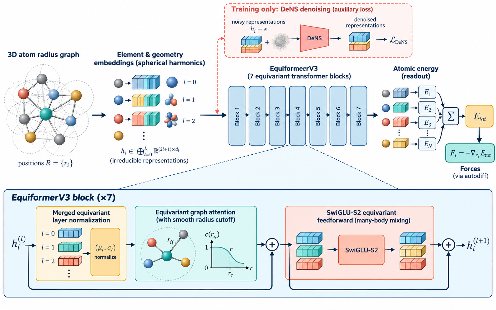</a> <strong>EquiformerV3 + DeNS</strong> · Transformer <small>排名 #4, #19 · EquiformerV3+DeNS-OAM · EquiformerV3+DeNS-MP</small> <small>论文：<a href="https://arxiv.org/abs/2604.09130">arXiv:2604.09130</a></small> | <a href="assets/04_GRACE-2L-3L-OAM-L.png">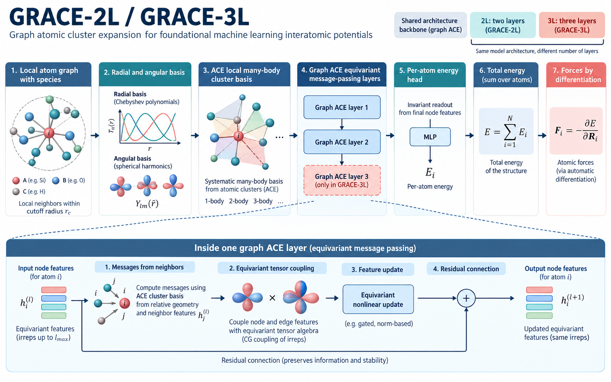</a> <strong>GRACE · OAM</strong> · 等变网络 <small>排名 #5, #14 · GRACE-3L-OAM-L · GRACE-2L-OAM-L</small> <small>论文：<a href="https://arxiv.org/abs/2508.17936">arXiv:2508.17936</a></small> |
| <a href="assets/05_PET-OAM-XL.png">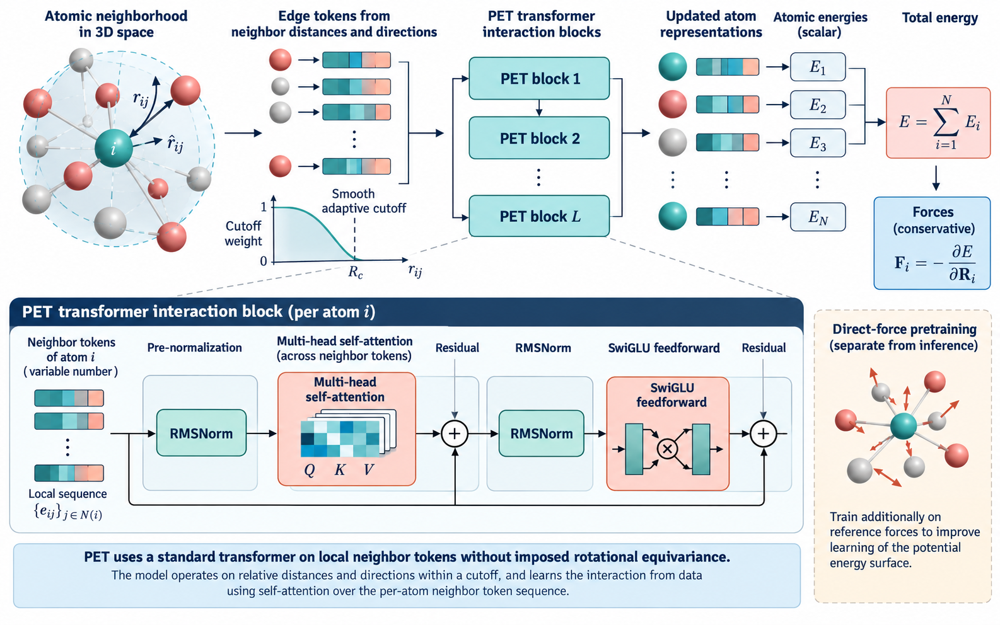</a> <strong>PET</strong> · Transformer <small>排名 #6 · PET-OAM-XL</small> <small>论文：<a href="https://arxiv.org/abs/2601.16195">arXiv:2601.16195</a></small> | <a href="assets/06_TACE-OAM-L.png">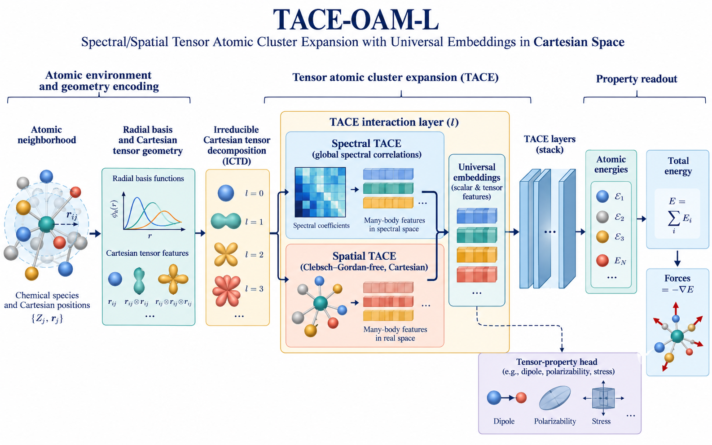</a> <strong>TACE</strong> · 等变网络 <small>排名 #7 · TACE-OAM-L</small> <small>论文：<a href="https://arxiv.org/abs/2509.14961">arXiv:2509.14961</a></small> |
| <a href="assets/07_eSEN-30M-OAM.png">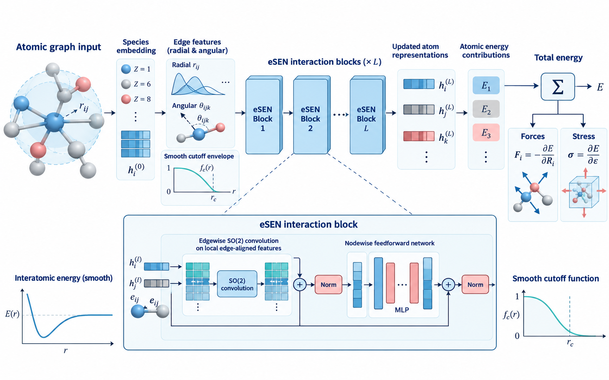</a> <strong>eSEN</strong> · 等变网络 <small>排名 #8, #21 · eSEN-30M-OAM · eSEN-30M-MP</small> <small>论文：<a href="https://arxiv.org/abs/2502.12147">arXiv:2502.12147</a></small> | <a href="assets/08_Nequip-OAM-XL-L.png">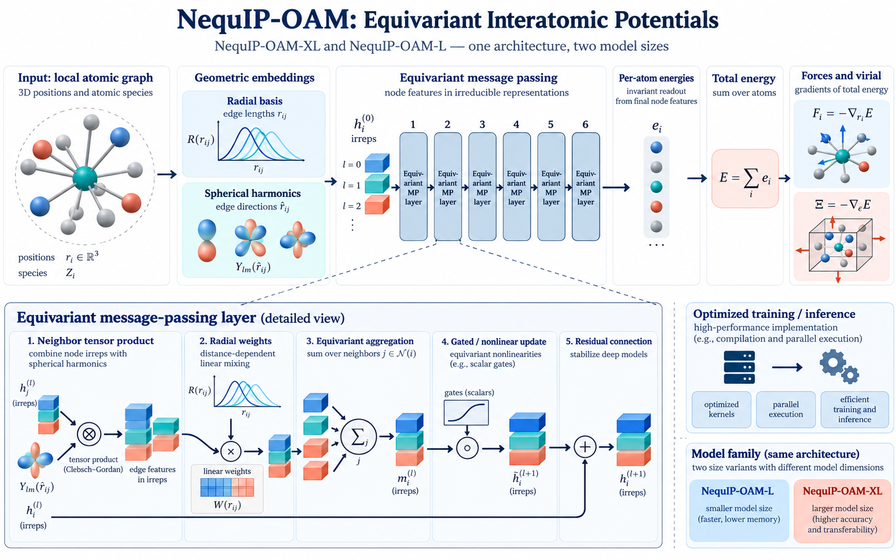</a> <strong>NequIP</strong> · 等变网络 <small>排名 #10, #13, #29 · Nequip-OAM-XL · Nequip-OAM-L · Nequip-MP-L</small> <small>论文：<a href="https://arxiv.org/abs/2504.16068">arXiv:2504.16068</a></small> |
| <a href="assets/09_MatRIS-10M-OAM.png">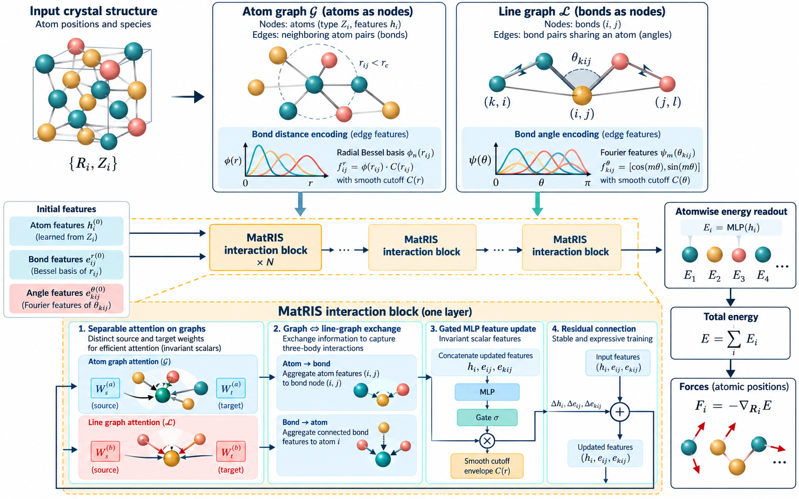</a> <strong>MatRIS</strong> · 图网络 <small>排名 #11, #23 · MatRIS-10M-OAM · MatRIS-10M-MP</small> <small>论文：<a href="https://arxiv.org/abs/2603.02002">arXiv:2603.02002</a></small> | <a href="assets/10_SevenNet-Omni-i12.png">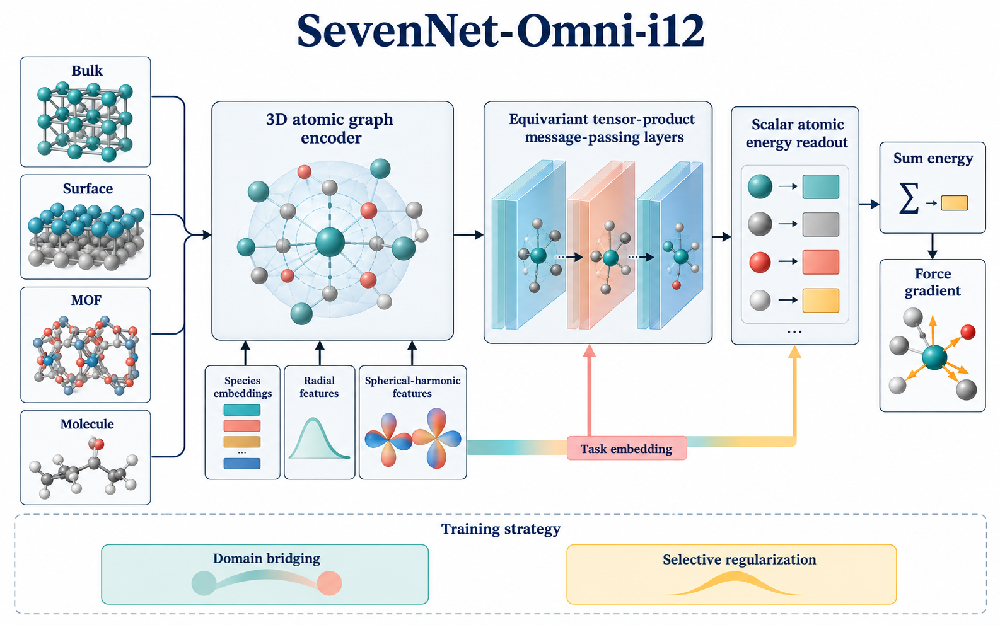</a> <strong>SevenNet-Omni</strong> · 等变网络 <small>排名 #12 · SevenNet-Omni-i12</small> <small>论文：<a href="https://arxiv.org/abs/2510.11241">arXiv:2510.11241</a></small> |
| <a href="assets/11_ORB-v3.png">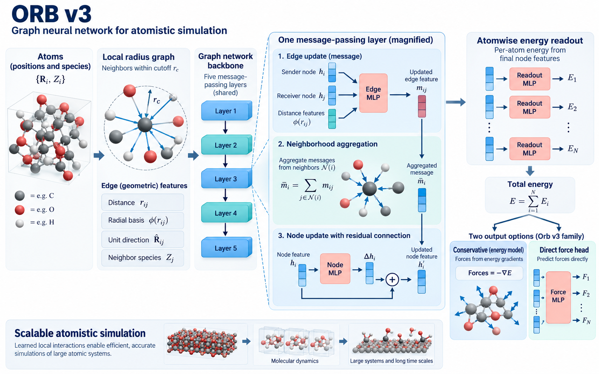</a> <strong>ORB v3</strong> · 图网络 <small>排名 #15 · ORB v3</small> <small>论文：<a href="https://arxiv.org/abs/2504.06231">arXiv:2504.06231</a></small> | &nbsp; |

[返回目录](#目录)

---

## 第 16–42 名

继续按架构去重；排名 27 的 Eqnorm 尚无对应论文。

本节 **15 张图**。点击图片可打开原始 PNG。

|  |  |
|---|---|
| <a href="assets/16_DPA4.png">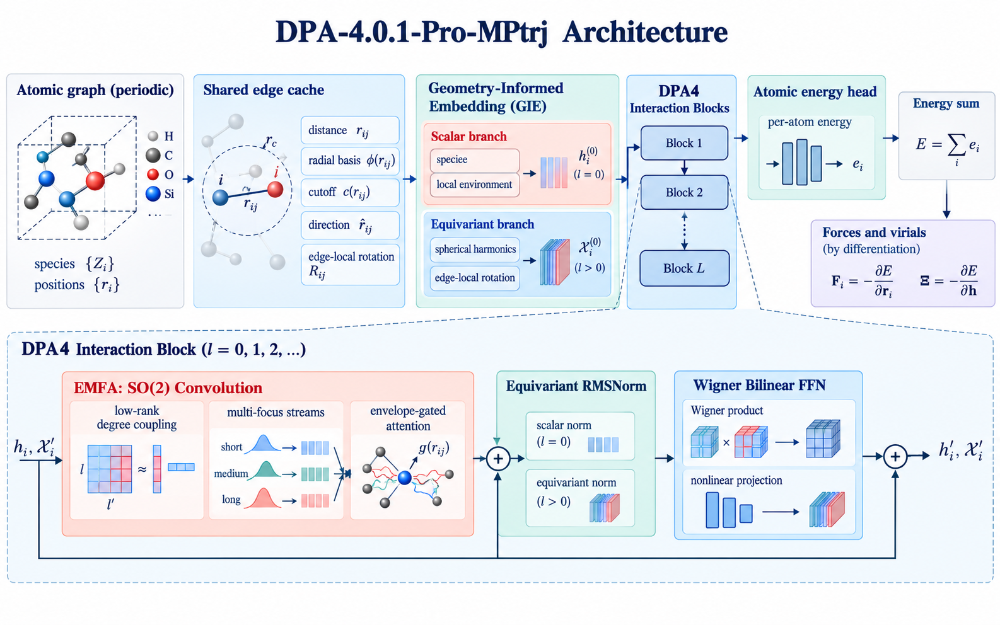</a> <strong>DPA-4</strong> · 图网络 <small>排名 #16 · DPA-4.0.1-Pro-MPtrj</small> <small>论文：<a href="https://arxiv.org/abs/2606.02419">arXiv:2606.02419</a></small> | <a href="assets/17_Allegro-OAM-MP-L.png">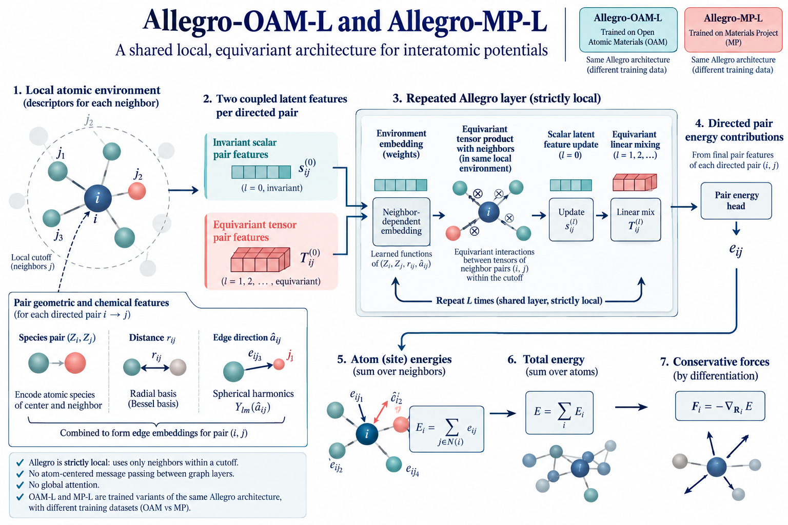</a> <strong>Allegro</strong> · 等变网络 <small>排名 #17, #31 · Allegro-OAM-L · Allegro-MP-L</small> <small>论文：<a href="https://arxiv.org/abs/2204.05249">arXiv:2204.05249</a> · <a href="https://arxiv.org/abs/2504.16068">arXiv:2504.16068</a></small> |
| <a href="assets/18_GRACE-1L-2L.png">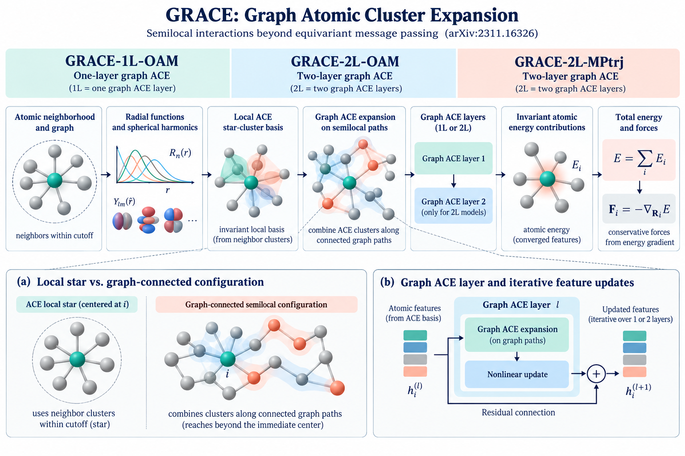</a> <strong>GRACE · 1L/2L</strong> · 等变网络 <small>排名 #18, #26, #34 · GRACE-2L-OAM · GRACE-1L-OAM · GRACE-2L-MPtrj</small> <small>论文：<a href="https://arxiv.org/abs/2311.16326">arXiv:2311.16326</a></small> | <a href="assets/20_DPA3.png">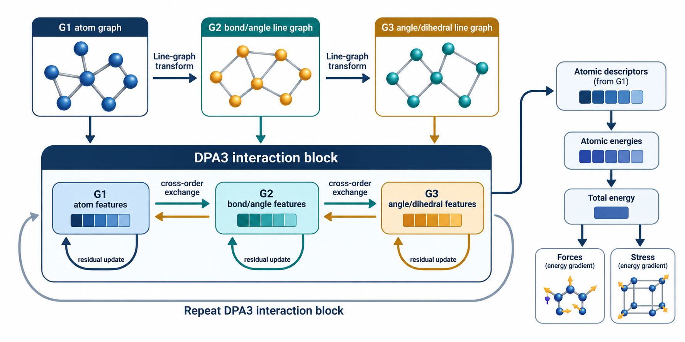</a> <strong>DPA-3</strong> · 图网络 <small>排名 #20 · DPA-3.1-3M-FT</small> <small>论文：<a href="https://arxiv.org/abs/2506.01686">arXiv:2506.01686</a></small> |
| <a href="assets/22_MACE-MP-MPA.png">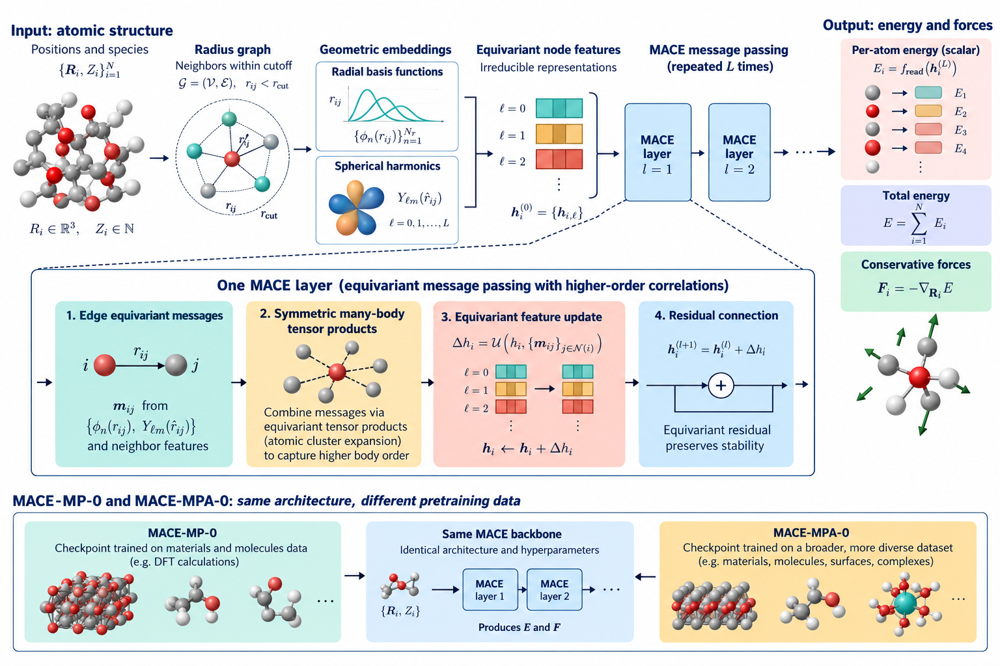</a> <strong>MACE</strong> · 等变网络 <small>排名 #22, #35 · MACE-MPA-0 · MACE-MP-0</small> <small>论文：<a href="https://arxiv.org/abs/2206.07697">arXiv:2206.07697</a> · <a href="https://arxiv.org/abs/2401.00096">arXiv:2401.00096</a></small> | <a href="assets/24_AlphaNet-v1.png">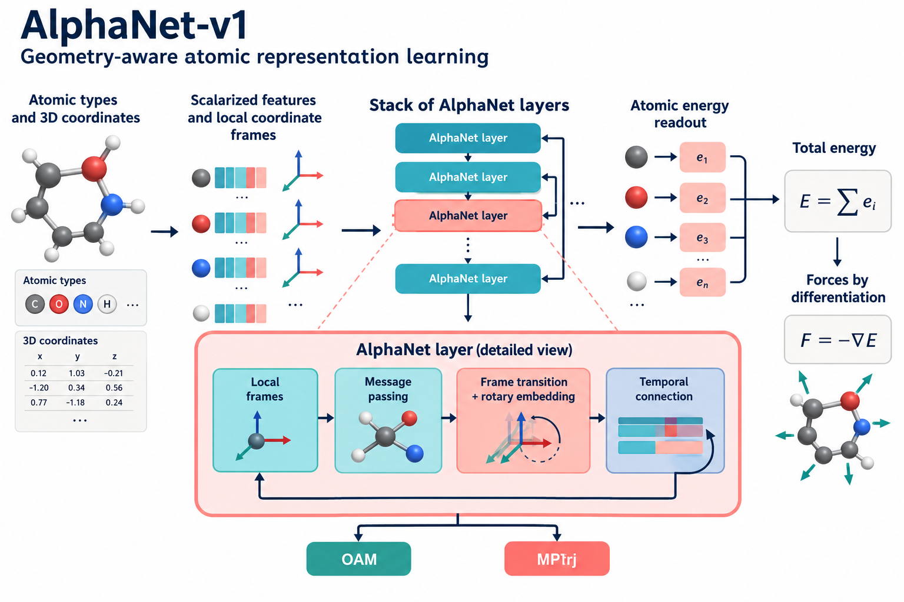</a> <strong>AlphaNet</strong> · 等变网络 <small>排名 #24 · AlphaNet-v1-OAM</small> <small>论文：<a href="https://arxiv.org/abs/2501.07155">arXiv:2501.07155</a></small> |
| <a href="assets/25_MatterSim-v1-5M.png">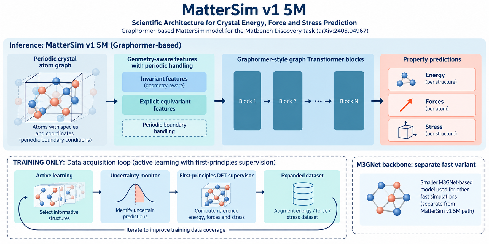</a> <strong>MatterSim v1</strong> · Transformer <small>排名 #25 · MatterSim v1 5M</small> <small>论文：<a href="https://arxiv.org/abs/2405.04967">arXiv:2405.04967</a></small> | <a href="assets/28_30_Nequix-MP-PFT.png">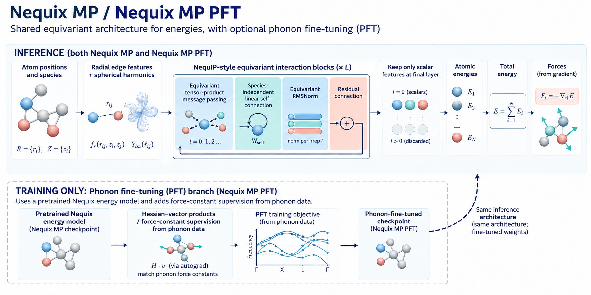</a> <strong>Nequix</strong> · 等变网络 <small>排名 #28, #30 · Nequix MP PFT · Nequix MP</small> <small>论文：<a href="https://arxiv.org/abs/2601.07742">arXiv:2601.07742</a> · <a href="https://arxiv.org/abs/2508.16067">arXiv:2508.16067</a></small> |
| <a href="assets/32_SevenNet-l3i5.png">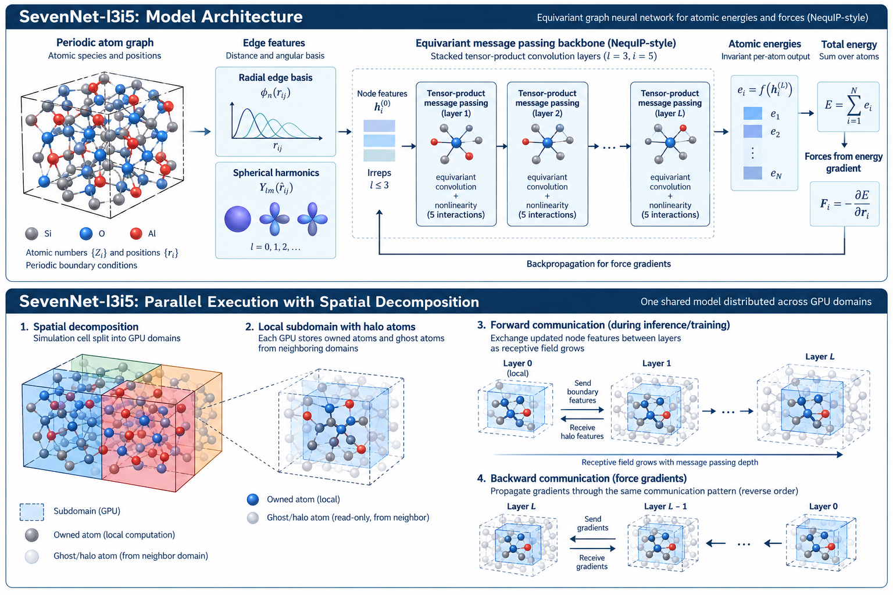</a> <strong>SevenNet-l3i5</strong> · 等变网络 <small>排名 #32 · SevenNet-l3i5</small> <small>论文：<a href="https://arxiv.org/abs/2402.03789">arXiv:2402.03789</a></small> | <a href="assets/33_HIENet.png">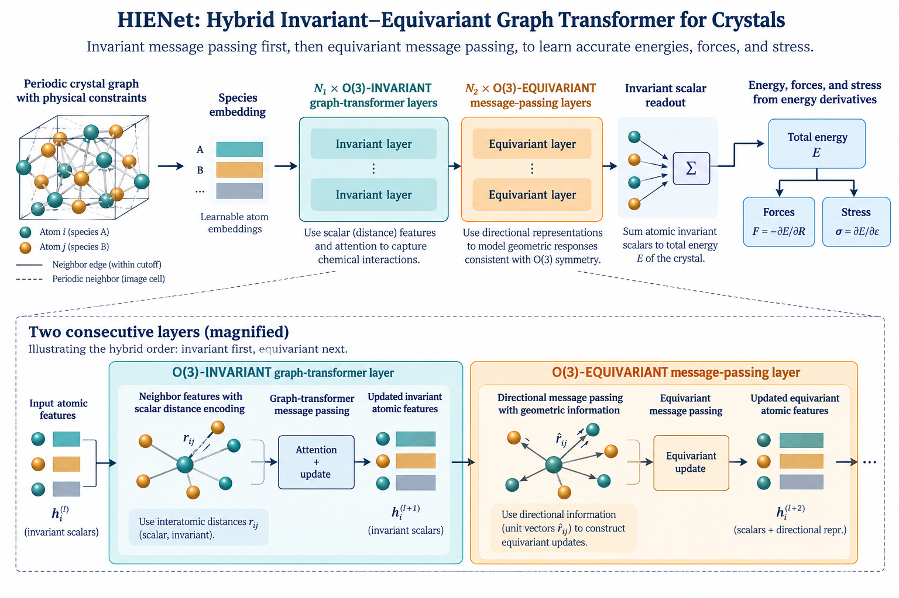</a> <strong>HIENet</strong> · 图网络 <small>排名 #33 · HIENet</small> <small>论文：<a href="https://arxiv.org/abs/2503.05771">arXiv:2503.05771</a></small> |
| <a href="assets/36_BAM-MP-core.png">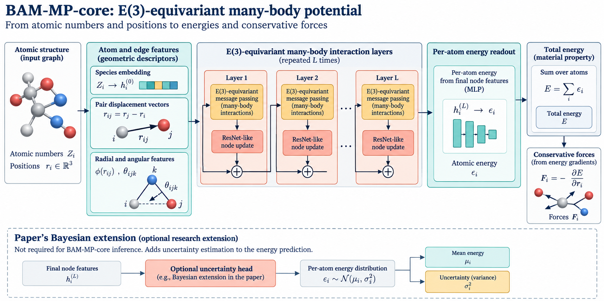</a> <strong>BAM</strong> · 图网络 <small>排名 #36 · BAM-MP-core</small> <small>论文：<a href="https://arxiv.org/abs/2510.03046">arXiv:2510.03046</a></small> | <a href="assets/37_39_EquiformerV2.png">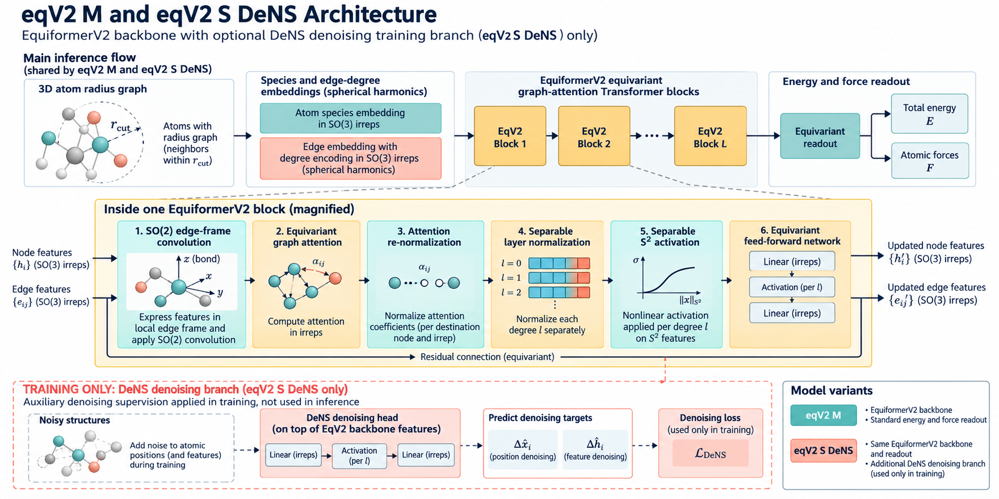</a> <strong>EquiformerV2</strong> · Transformer <small>排名 #37, #39 · eqV2 M · eqV2 S DeNS</small> <small>论文：<a href="https://arxiv.org/abs/2306.12059">arXiv:2306.12059</a> · <a href="https://arxiv.org/abs/2410.12771">arXiv:2410.12771</a></small> |
| <a href="assets/38_40_ORB-v2.png">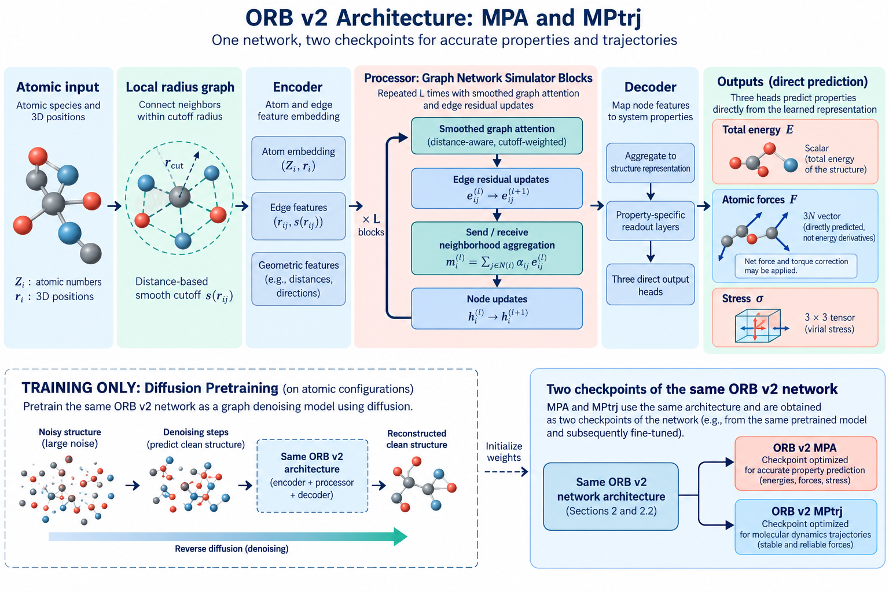</a> <strong>ORB v2</strong> · 图网络 <small>排名 #38, #40 · ORB v2 MPA · ORB v2 MPtrj</small> <small>论文：<a href="https://arxiv.org/abs/2410.22570">arXiv:2410.22570</a></small> | <a href="assets/41_M3GNet.png">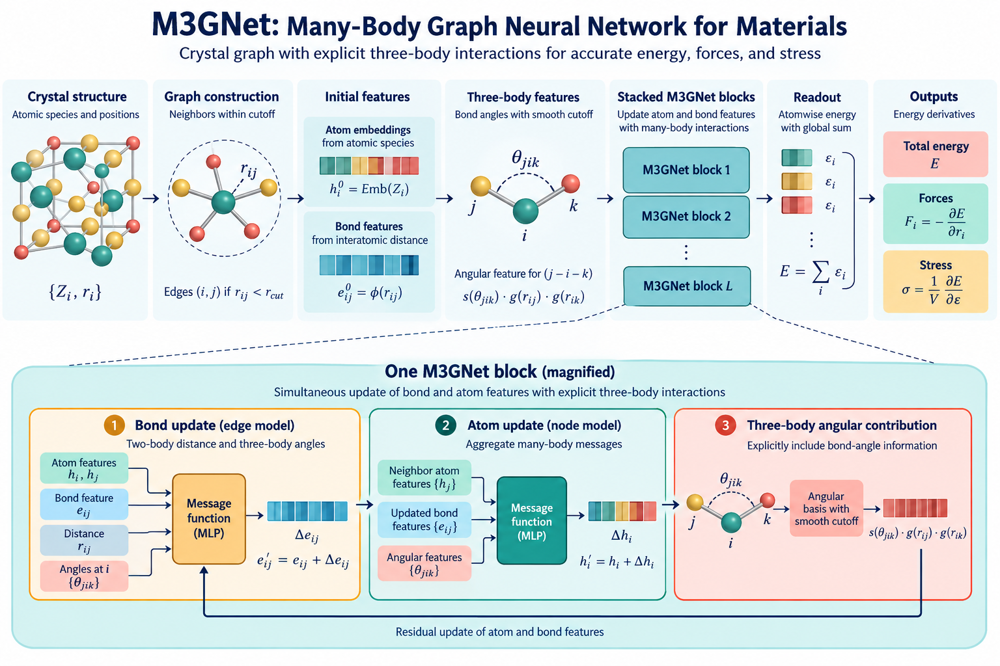</a> <strong>M3GNet</strong> · 图网络 <small>排名 #41 · M3GNet</small> <small>论文：<a href="https://arxiv.org/abs/2202.02450">arXiv:2202.02450</a></small> |
| <a href="assets/42_CHGNet.png">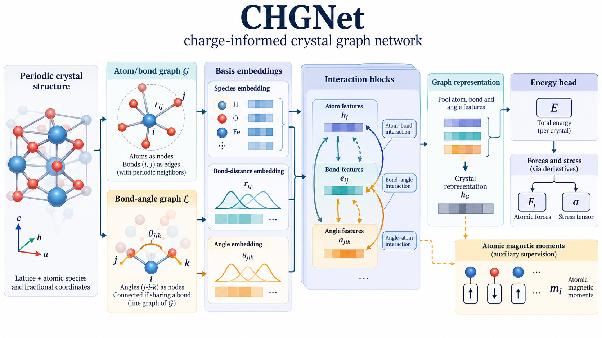</a> <strong>CHGNet</strong> · 图网络 <small>排名 #42 · CHGNet</small> <small>论文：<a href="https://arxiv.org/abs/2302.14231">arXiv:2302.14231</a></small> | &nbsp; |

[返回目录](#目录)

---

## 其他活跃模型

这些模型缺少默认 CPS 所需指标，不赋予虚构名次。

本节 **9 张图**。点击图片可打开原始 PNG。

|  |  |
|---|---|
| <a href="assets/unranked_ALIGNN.png">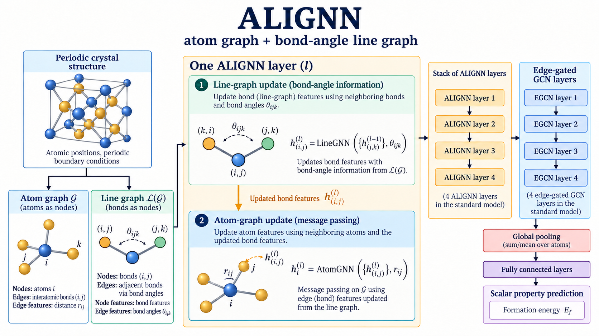</a> <strong>ALIGNN</strong> · 图网络 <small>活跃 · 无 CPS 排名 · ALIGNN</small> <small>论文：<a href="https://arxiv.org/abs/2106.01829">arXiv:2106.01829</a></small> | <a href="assets/unranked_BOWSR.png">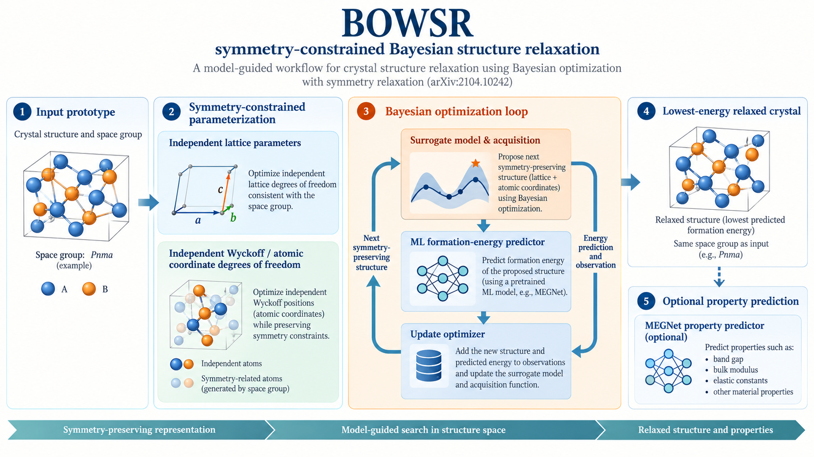</a> <strong>BOWSR</strong> · 优化流程 <small>活跃 · 无 CPS 排名 · BOWSR</small> <small>论文：<a href="https://arxiv.org/abs/2104.10242">arXiv:2104.10242</a></small> |
| <a href="assets/unranked_CGCNN_and_P.png">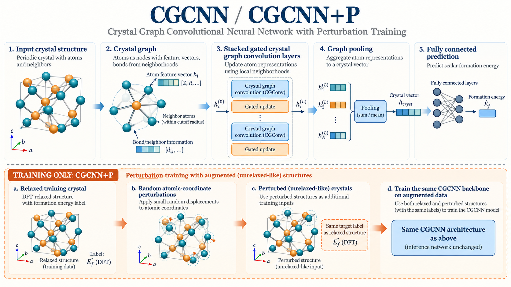</a> <strong>CGCNN / CGCNN+P</strong> · 图网络 <small>活跃 · 无 CPS 排名 · CGCNN · CGCNN+P</small> <small>论文：<a href="https://arxiv.org/abs/1710.10324">arXiv:1710.10324</a> · <a href="https://arxiv.org/abs/2202.13947">arXiv:2202.13947</a></small> | <a href="assets/unranked_MEGNet.png">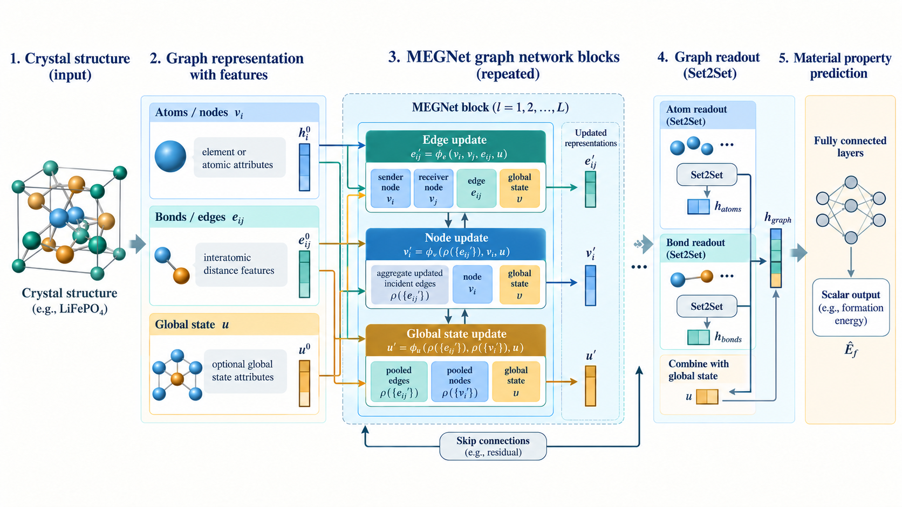</a> <strong>MEGNet</strong> · 图网络 <small>活跃 · 无 CPS 排名 · MEGNet</small> <small>论文：<a href="https://arxiv.org/abs/1812.05055">arXiv:1812.05055</a></small> |
| <a href="assets/unranked_Wrenformer.png">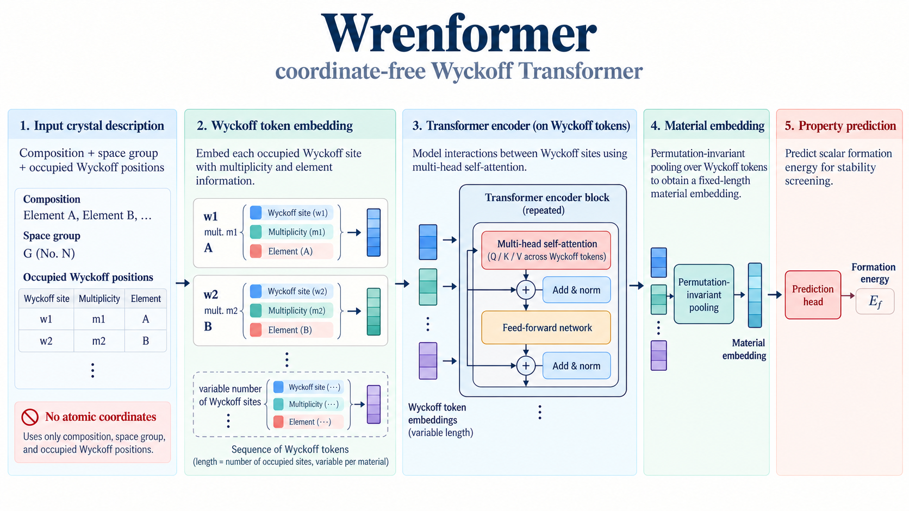</a> <strong>Wrenformer</strong> · Transformer <small>活跃 · 无 CPS 排名 · Wrenformer</small> <small>论文：<a href="https://arxiv.org/abs/2106.11132">arXiv:2106.11132</a> · <a href="https://arxiv.org/abs/2308.14920">arXiv:2308.14920</a></small> | <a href="assets/unranked_Voronoi-RF.png">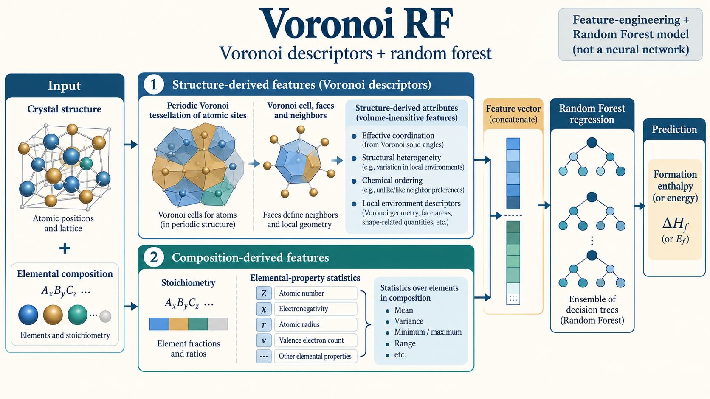</a> <strong>Voronoi RF</strong> · 传统 ML <small>活跃 · 无 CPS 排名 · Voronoi RF</small> <small>论文：<a href="https://doi.org/10.1103/PhysRevB.96.024104">Phys. Rev. B</a></small> |
| <a href="assets/unranked_AlchemBERT.png">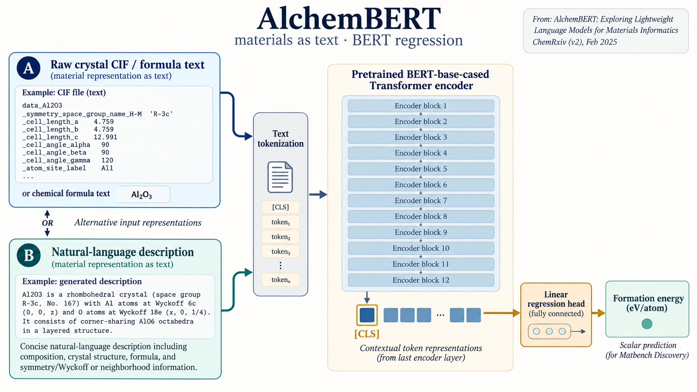</a> <strong>AlchemBERT</strong> · Transformer <small>活跃 · 无 CPS 排名 · AlchemBERT</small> <small>论文：<a href="https://doi.org/10.26434/chemrxiv-2024-r4dnl">ChemRxiv</a></small> | <a href="assets/unranked_ESNet.png">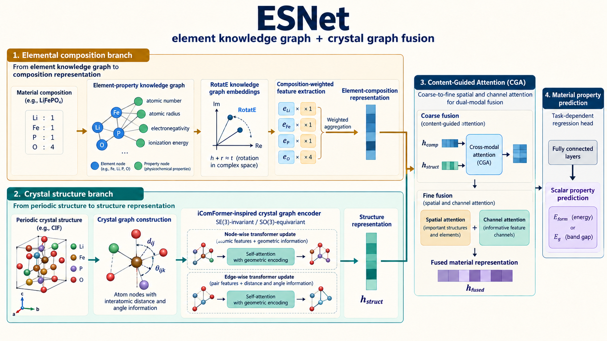</a> <strong>ESNet</strong> · Transformer <small>活跃 · 无 CPS 排名 · ESNet</small> <small>论文：<a href="https://doi.org/10.21203/rs.3.rs-5979703/v1">Research Square</a></small> |
| <a href="assets/unranked_NequIP-GNoME.png">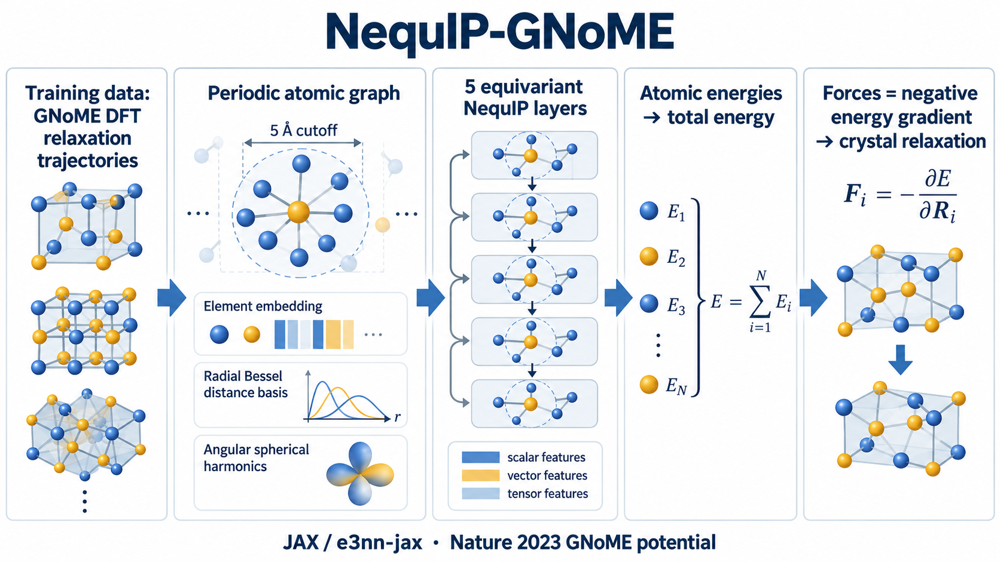</a> <strong>NequIP-GNoME</strong> · 等变网络 <small>活跃 · 无 CPS 排名 · NequIP-GNoME</small> <small>论文：<a href="https://www.nature.com/articles/s41586-023-06735-9">Nature</a></small> | &nbsp; |

[返回目录](#目录)

---

## 无对应架构论文的模型

以下条目保留在[完整模型索引](SOURCES.md)中，未据无关论文推测架构：

| 模型 | 处理原因 |
|---|---|
| EquFlashV2、EquFlash | 注册表链接指向 FlashTP 计算核论文，不是这两个模型的架构论文。 |
| Eqnorm MPtrj | 尚无确认的模型论文。 |
| EMA-GNN | 尚无确认的独立模型论文。 |

## 资料与文件

- 新增的四篇非 arXiv 原文由用户提供，保存在源工作目录 `matbench-discovery-gallery/paper/non_arxiv/`；Git 仓库使用论文在线链接，避免重复存放大体积 PDF。
- [`SOURCES.md`](SOURCES.md) 列出全部 53 个模型的排名、论文和架构图对应关系。
- `assets/` 收录最终采用的 35 张 PNG；同一架构的模型变体复用文件。
- `index.html`、`styles.css`、`gallery.js`、`data.js` 构成交互式离线图库；无需构建步骤。

设计参考 [LLM Architecture Gallery](https://sebastianraschka.com/llm-architecture-gallery/)。
